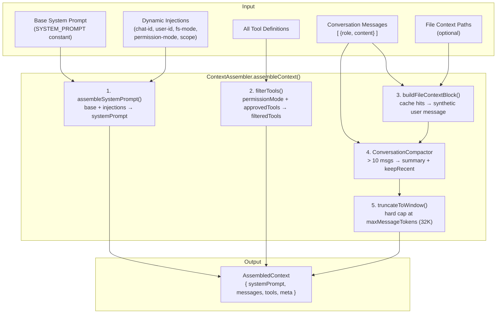

# 10 — Context Assembly: Context Window Construction

> **Scope**: `src/engine/contextAssembly.ts` (~220 lines) — integrated into `src/llm.ts`
>
> **One-liner**: How Chokito assembles the final context window sent to the LLM — merging system prompt injections, filtering tools by permission mode, applying compaction + hard truncation, and optionally injecting file context.

---

## Architecture Overview



---

## 1. System Prompt Assembly

`assembleSystemPrompt(base, injections[])` concatenates the static base prompt with dynamic `SystemInjection` lines:

```typescript
interface SystemInjection {
  label: string  // debug identifier
  text: string   // appended line
}
```

Injections produced by `buildContextInjections(context)` in `llm.ts`:

| Label | Content |
|---|---|
| `chat-id` | `Current conversation id: {chatId}` |
| `user-id` | `Current owner id: {userId}` |
| `fs-mode` | Filesystem access level (full / restricted) |
| `permission-mode` | Operational mode: ask / auto / read_only |
| `workflow-scope` | Workflow tool scoping reminder |

---

## 2. Tool Filtering

`filterTools(allTools, permissionMode, approvedTools)` applies two gates:

1. **Permission mode gate** — `read_only` restricts to tools prefixed with `read_`, `get_`, `list_`, `search_`, `file_read`, `bash_read`
2. **Approved-tools gate** — if `approvedTools[]` is non-empty, only listed tools pass through

Both gates are AND-combined. This prevents mutating tools from executing in restricted sessions without requiring upstream changes.

---

## 3. File Context Injection

`buildFileContextBlock(paths, cache)` wraps LRUCache hits into XML-tagged blocks:

```
[Injected file context]
<file path="src/foo.ts">
... content ...
</file>
[End file context]
```

The block is prepended as a synthetic `user` message. Cache misses are silently skipped — callers pre-populate the cache when needed.

---

## 4. Compaction

Delegates to `ConversationCompactor` (see [05 — Hook System](05-hook-system.md) → engine). Applied when `messages.length > 10`:
- Summarizes older turns into a `[Earlier conversation summary]` block
- Keeps last 5 messages verbatim
- Only activates if `tokensSaved > 0`

---

## 5. Hard Truncation

`truncateToWindow(messages, maxTokens)` is the last-resort fallback:

- Estimates tokens: `⌈chars / 4⌉ + 4` overhead per message
- Drops oldest messages until below `maxMessageTokens` (default: 32,000)
- Never drops to fewer than 1 message

Applied after compaction so it only triggers on very long sessions where compaction wasn't sufficient.

---

## AssembledContext

```typescript
interface AssembledContext {
  systemPrompt: string
  messages: ContextMessage[]
  tools: unknown[]
  meta: AssemblyMeta
}

interface AssemblyMeta {
  originalMessageCount: number
  finalMessageCount: number
  compactionApplied: boolean
  truncationApplied: boolean
  fileContextInjected: number
  toolCount: number
  estimatedTokens: number
}
```

The `meta` field enables observability — callers can log or monitor assembly decisions without coupling to the internals.

---

## Integration in llm.ts

Both `runAgent()` and `streamAgent()` now call `assembleContext()` as the first step:

```typescript
const assembled = await contextAssembler.assembleContext({
  baseSystemPrompt: SYSTEM_PROMPT,
  injections: buildContextInjections(context),
  messages,
  tools: allTools,
  permissionMode: context?.permissionMode,
  approvedTools: context?.approvedTools,
  compactor,
})

// Then:
input: [{ role: 'system', content: assembled.systemPrompt }, ...assembled.messages]
tools: assembled.tools
```

---

## Component Summary

| Component | Lines | Role |
|---|---|---|
| `contextAssembly.ts` | ~220 | ContextAssembler class + singleton |
| `llm.ts` (integration) | +30 / -40 | Removed `buildSystemPrompt` + `prepareMessagesWithCompaction` |

---

**Previous**: [← 09 — Session Persistence](09-session-persistence.md)
